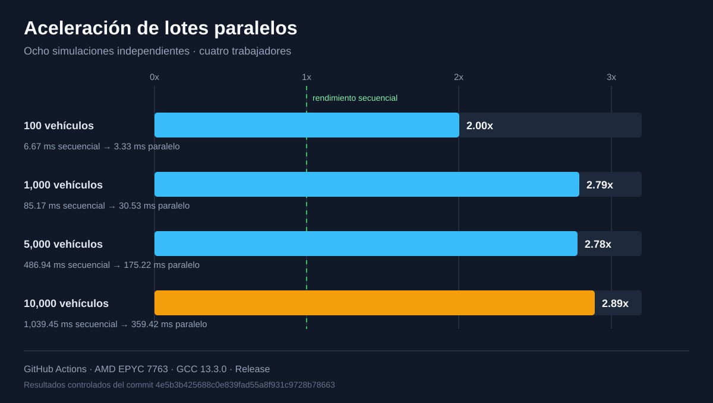

# TrafficSim

[](https://github.com/enrique-diazv/traffic-sim/actions/workflows/ci.yml)


TrafficSim es un motor determinista de simulación de tráfico desarrollado en
C++20. Modela redes de carreteras dirigidas, vehículos, rutas, semáforos,
congestión y estadísticas mediante una arquitectura modular y verificable.

El proyecto incluye una aplicación de consola, un visualizador interactivo
desarrollado con SFML, carga de escenarios JSON, exportación de resultados CSV,
experimentos por lotes y benchmarks reproducibles mediante GitHub Actions.

## Vista previa

[](docs/media/trafficsim-demo.mp4)

El visualizador representa las carreteras, intersecciones, vehículos y estados
de los semáforos utilizando exclusivamente el estado público del motor.

Selecciona la imagen para abrir una demostración grabada de la simulación.

## Rendimiento medido



Con 10,000 vehículos por simulación, el lote paralelo consiguió una aceleración
observada de 2.89x frente al lote secuencial. La metodología, el entorno y las
limitaciones de la comparación se explican en
[la documentación de rendimiento](docs/performance.md).

## Estado actual

**Sprint 15 de 16: presentación y preparación para portafolio.**

Actualmente están implementados:

- Red de carreteras dirigida con intersecciones y carreteras validadas.
- Planificación de rutas mediante Dijkstra y A*.
- Costos de ruta sensibles a la congestión.
- Movimiento de vehículos con aceleración, frenado y seguimiento.
- Semáforos y controladores de tráfico.
- Simulación determinista con paso de tiempo fijo y semillas configurables.
- Generación programada de vehículos y recálculo dinámico de rutas.
- Recopilación de estadísticas y exportación de resultados CSV.
- Carga y validación de escenarios definidos en JSON.
- Experimentos parametrizados y ejecución independiente por lotes.
- Ejecución paralela limitada a simulaciones independientes.
- Visualizador interactivo opcional construido con SFML.
- Benchmarks reproducibles para cargas de hasta 10,000 vehículos.
- Compilación portable mediante CMake para MSVC, GCC y Clang.
- Pruebas automatizadas con GoogleTest y CTest.
- Formato y análisis estático mediante clang-format y clang-tidy.

El motor principal permanece desacoplado de la visualización. La simulación
puede ejecutarse desde consola, pruebas, benchmarks o experimentos sin depender
de SFML.

## Requisitos

### Herramientas esenciales

- CMake 3.28 o posterior.
- Un compilador compatible con C++20:
  - MSVC.
  - GCC.
  - Clang.
- Git.
- Conexión a Internet durante la primera configuración para descargar las
  dependencias mediante CMake `FetchContent`.

En Windows se recomienda Visual Studio Build Tools con el componente de
desarrollo para escritorio con C++.

### Herramientas opcionales

- LLVM, para ejecutar clang-format y clang-tidy.
- Ninja, para reproducir localmente la configuración de benchmarks utilizada
  en Linux.

GoogleTest y nlohmann/json se descargan automáticamente al configurar los
targets que los necesitan. SFML también se descarga automáticamente cuando se
configura el visualizador.

## Configurar y compilar

Ejecuta los siguientes comandos desde la raíz del repositorio:

```powershell
cmake --preset debug
cmake --build --preset debug
```

La primera configuración descarga automáticamente las dependencias necesarias.
Las configuraciones posteriores reutilizan las dependencias y los archivos
generados dentro de `out/build/debug`.

## Ejecutar la simulación

En Windows con Visual Studio:

```powershell
.\out\build\debug\Debug\trafficsim.exe
```

En Linux con un generador de configuración única:

```bash
./out/build/debug/trafficsim
```

Sin argumentos, la aplicación carga `scenarios/basic.json`. También se puede
indicar otro escenario:

```powershell
.\out\build\debug\Debug\trafficsim.exe .\scenarios\basic.json
```

Al finalizar, la aplicación muestra un resumen en la consola y exporta los
resultados CSV dentro del directorio `results`.

## Ejecutar las pruebas

Después de compilar la configuración Debug, ejecuta:

```powershell
ctest --preset debug
```

El preset muestra automáticamente la salida de las pruebas que fallen. La suite
actual contiene 201 pruebas unitarias y de integración para la red, las rutas,
los vehículos, la simulación, los semáforos, la carga de escenarios, las
estadísticas, los experimentos y la ejecución paralela por lotes.

Para ejecutar solamente un grupo de pruebas se puede utilizar una expresión
regular de CTest. Por ejemplo:

```powershell
ctest --preset debug -R "VehicleTests"
```

## Verificar el formato

Para comprobar todo el código fuente sin modificarlo:

```powershell
$sourceFiles = Get-ChildItem `
    -Recurse `
    -File `
    -Path .\include, .\src, .\tests, .\benchmarks `
    -Include *.h, *.cpp

clang-format --dry-run --Werror $sourceFiles.FullName
```

Para aplicar automáticamente el formato:

```powershell
clang-format -i $sourceFiles.FullName
```

## Ejecutar el análisis estático

clang-tidy se puede ejecutar sobre un archivo de implementación utilizando las
opciones de MSVC necesarias para C++20, excepciones y encabezados del proyecto:

```powershell
clang-tidy .\src\core\Simulation.cpp `
    --extra-arg-before=--driver-mode=cl `
    --extra-arg=/std:c++20 `
    --extra-arg=/EHsc `
    --extra-arg=-I.\include `
    --
```

Los mensajes que indican advertencias suprimidas en código externo son
informativos. Se deben corregir las advertencias que señalen archivos dentro de
`include`, `src`, `tests` o `benchmarks`.

## Compilar una versión Release

La configuración Release compila la aplicación de consola y el ejecutable de
experimentos sin incluir las pruebas:

```powershell
cmake --preset release
cmake --build --preset release
```

Para ejecutar la simulación optimizada en Windows:

```powershell
.\out\build\release\Release\trafficsim.exe .\scenarios\basic.json
```

## Ejecutar experimentos por lotes

El ejecutable de experimentos carga un plan JSON, genera sus variantes, realiza
las repeticiones configuradas y exporta los resultados agregados:

```powershell
.\out\build\release\Release\trafficsim_experiments.exe `
    .\experiments\basic_sweep.json
```

Sin argumentos utiliza `experiments/basic_sweep.json`. Las rutas del escenario
y del directorio de resultados se definen dentro del propio plan.

## Compilar y ejecutar el visualizador

El visualizador es opcional y utiliza SFML 3.1. CMake descarga SFML y copia
automáticamente el escenario básico y la fuente requerida junto al ejecutable:

```powershell
cmake --preset visualizer
cmake --build --preset visualizer
```

Para ejecutarlo en Windows:

```powershell
.\out\build\visualizer\Debug\trafficsim_visualizer.exe
```

También se puede proporcionar un escenario diferente:

```powershell
.\out\build\visualizer\Debug\trafficsim_visualizer.exe `
    .\scenarios\basic.json
```

### Controles

| Entrada | Acción |
|---|---|
| `Espacio` | Iniciar o pausar la simulación |
| `Flecha derecha` | Avanzar un paso mientras está pausada |
| `R` | Reiniciar la simulación |
| `W`, `A`, `S`, `D` | Desplazar la cámara |
| Rueda del mouse | Acercar o alejar |
| `F` | Ajustar la red a la ventana |
| `Esc` | Cerrar el visualizador |

## Estructura del proyecto

```text
traffic-sim/
├── .github/
│   └── workflows/          # Automatización y benchmarks reproducibles
├── assets/
│   └── fonts/              # Recursos utilizados por el visualizador
├── benchmarks/             # Infraestructura de medición de rendimiento
├── docs/
│   ├── architecture.md     # Arquitectura y decisiones de diseño
│   └── performance.md      # Metodología y resultados de rendimiento
├── experiments/
│   └── basic_sweep.json    # Plan de experimento de ejemplo
├── include/
│   └── trafficsim/         # API pública del motor
│       ├── core/
│       ├── experiments/
│       ├── io/
│       ├── network/
│       ├── routing/
│       ├── statistics/
│       ├── traffic/
│       └── vehicles/
├── scenarios/
│   └── basic.json          # Escenario ejecutable de ejemplo
├── src/
│   ├── app/                # Aplicación de consola
│   ├── core/               # Coordinación de la simulación
│   ├── experiment_app/     # Aplicación de experimentos
│   ├── experiments/
│   ├── io/
│   ├── network/
│   ├── routing/
│   ├── statistics/
│   ├── traffic/
│   ├── vehicles/
│   └── visualization/      # Frontend opcional con SFML
├── tests/
│   ├── integration/
│   └── unit/
├── CMakeLists.txt
├── CMakePresets.json
└── README.md
```

Los encabezados públicos se encuentran en `include/trafficsim` y sus
implementaciones en `src`. Las aplicaciones dependen de `trafficsim_core`,
mientras que el motor no depende de la consola ni del visualizador.

## Escenarios de ejemplo

| Escenario | Descripción |
|---|---|
| [Básico](scenarios/basic.json) | Red lineal de tres intersecciones con un semáforo y tres vehículos |
| [Rutas alternativas](scenarios/alternate_routes.json) | Red en forma de diamante con dos rutas, capacidades diferentes y ocho vehículos |

El escenario de rutas alternativas genera congestión medible y permite observar
cómo el costo de las rutas influye en la distribución del tráfico.

## Documentación técnica

- [Arquitectura y decisiones de diseño](docs/architecture.md)
- [Metodología y resultados de rendimiento](docs/performance.md)
- [Plan de experimento reproducible](experiments/basic_sweep.json)

## Hoja de ruta

| Sprint | Resultado | Estado |
|---:|---|:---:|
| 0 | Fundamentos de C++20, CMake y pruebas | Completado |
| 1 | Red de carreteras basada en grafos | Completado |
| 2 | Enrutamiento mediante Dijkstra | Completado |
| 3 | Modelo y movimiento de vehículos | Completado |
| 4 | Motor determinista de simulación | Completado |
| 5 | Semáforos y control de tráfico | Completado |
| 6 | Seguimiento y prevención de solapamientos | Completado |
| 7 | Estadísticas e informes CSV | Completado |
| 8 | Carga y validación de escenarios JSON | Completado |
| 9 | Medición y clasificación de congestión | Completado |
| 10 | A*, costos dinámicos y recálculo de rutas | Completado |
| 11 | Visualizador interactivo con SFML | Completado |
| 12 | Experimentos parametrizados por lotes | Completado |
| 13 | Benchmarks y optimización basada en mediciones | Completado |
| 14 | Concurrencia limitada a simulaciones independientes | Completado |
| 15 | Documentación visual y publicación para portafolio | En progreso |

El Sprint 15 se limita a presentación y distribución: capturas, diagramas,
gráficas de rendimiento, escenarios de ejemplo, badges de integración continua
y una versión Release. No agregará nuevas reglas al motor de simulación.

## Alcance

TrafficSim se concentra en simulación determinista de tráfico sobre redes
dirigidas. Permanecen fuera del alcance actual la física realista de colisiones,
cambios de carril, peatones, transporte público, mapas reales, simulación 3D y
procesamiento distribuido.