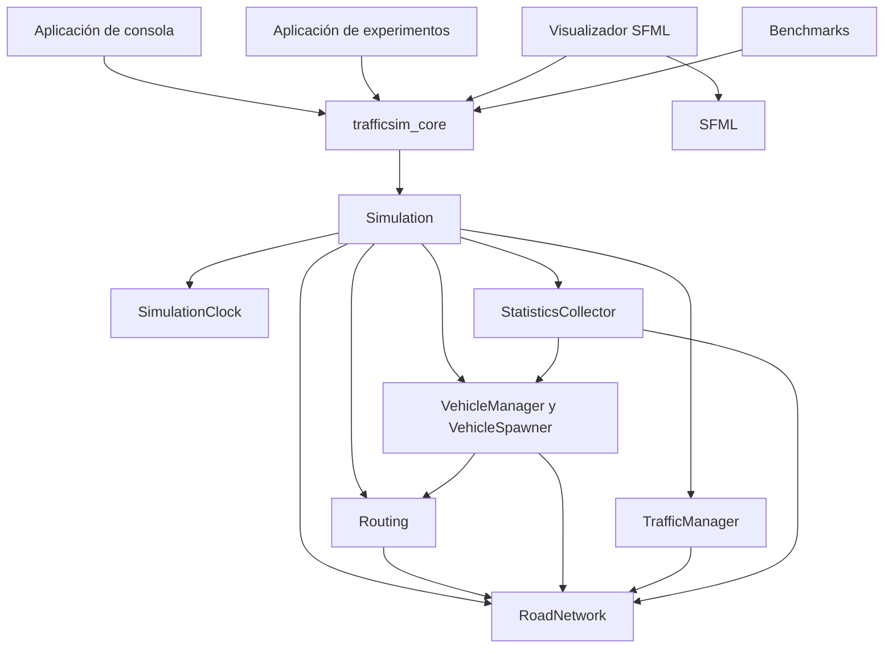
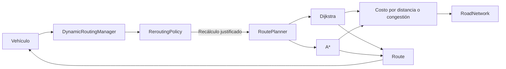

# Arquitectura de TrafficSim

## Estado del documento

Este documento describe la arquitectura implementada hasta el Sprint 14. El
motor, las aplicaciones, el visualizador, los experimentos y la infraestructura
de rendimiento mencionados aquí existen actualmente en el repositorio.

El Sprint 15 solo mejora la documentación, los recursos visuales y la
distribución del proyecto; no introduce nuevas reglas de simulación.

## Objetivos arquitectónicos

TrafficSim es un motor determinista de simulación de tráfico desarrollado en
C++20. Modela una red dirigida de carreteras y coordina vehículos, rutas,
intersecciones, semáforos, congestión, estadísticas y experimentos repetibles.

Las prioridades del diseño son:

1. Corrección.
2. Comprensibilidad.
3. Facilidad de prueba.
4. Mantenibilidad.
5. Determinismo.
6. Rendimiento medido.
7. Concurrencia solamente donde exista independencia demostrable.

## Vista general

`trafficsim_core` contiene el dominio y no depende de ninguna interfaz de
usuario. Las aplicaciones de consola, experimentos, benchmarks y visualización
consumen la misma biblioteca.

El visualizador mantiene una referencia al motor y representa su estado público.
La lógica de movimiento, enrutamiento y semáforos permanece dentro del motor y
no se duplica en objetos gráficos.

## Reglas de dependencias

- Las aplicaciones dependen de `trafficsim_core`.
- `trafficsim_core` no depende de las aplicaciones.
- La planificación de rutas consulta `RoadNetwork` mediante su API pública.
- Los vehículos se relacionan con carreteras e intersecciones mediante
  identificadores estables, sin poseerlas.
- El visualizador consulta el estado público del motor.
- SFML permanece aislado dentro de `src/visualization`.
- La simulación principal no depende del tiempo real de la computadora.
- Las simulaciones de un lote no comparten estado mutable.

## Decisiones de diseño

### C++20 y CMake

C++20 proporciona semántica por valor, RAII, algoritmos y herramientas de
concurrencia de la biblioteca estándar. CMake mantiene el proyecto portable
entre MSVC, GCC y Clang y permite activar por separado pruebas, visualización y
benchmarks.

### Red basada en grafos

Las intersecciones son nodos y las carreteras dirigidas son aristas. Una
carretera bidireccional se representa mediante dos aristas explícitas. Esta
representación permite consultar conexiones de salida y aplicar algoritmos
conocidos de búsqueda de rutas.

### Identificadores estables

`IntersectionId`, `RoadId` y `VehicleId` relacionan las entidades sin crear
propiedad mediante punteros. Los identificadores facilitan las búsquedas,
pruebas, mensajes de error, carga desde JSON y exportación CSV.

`RoadNetwork` y `VehicleManager` mantienen índices internos con
`std::unordered_map`. Las entidades continúan almacenándose por valor y los
contenedores internos no se exponen directamente.

### Enrutamiento

`RoutePlanner` define la abstracción común para calcular rutas. Dijkstra
proporciona la ruta mínima de referencia y A* utiliza la posición de las
intersecciones como heurística.

Los costos sensibles a congestión se calculan separadamente mediante
`CongestionAwareRouteCost`. `DynamicRoutingManager` solicita una nueva ruta
solamente cuando `ReroutingPolicy` determina que la degradación es suficiente;
el cálculo de rutas no se ejecuta en cada paso de simulación.

### Paso de tiempo fijo y determinismo

`SimulationClock` avanza utilizando el intervalo definido en
`SimulationConfig`, normalmente 0.1 segundos. La simulación nunca utiliza el
reloj de pared para calcular movimiento, semáforos o estadísticas.

`RandomGenerator` concentra la aleatoriedad y recibe una semilla explícita.
Ejecutar el mismo escenario, configuración, calendario de generación y semilla
produce resultados equivalentes.

### Vehículos y control de tráfico

`Vehicle` implementa el estado y movimiento de una unidad individual.
`VehicleManager` administra el conjunto activo y mantiene búsquedas eficientes
por identificador. `VehicleSpawner` convierte el calendario del escenario en
vehículos con rutas válidas.

Las decisiones sobre semáforos pertenecen a `TrafficManager` y
`TrafficLightController`. Los vehículos consultan el estado de la carretera
entrante, pero no controlan ni actualizan los semáforos.

### Estadísticas y entrada/salida

`StatisticsCollector` observa la simulación y conserva resultados de vehículos
y carreteras. `ConsoleReporter` presenta el resumen y `CsvExporter` escribe los
archivos sin introducir lógica de dominio.

`ScenarioLoader` transforma un documento JSON validado en la configuración, la
red, los semáforos y el calendario de generación necesarios para construir una
simulación.

### Concurrencia limitada

La simulación individual permanece deliberadamente en un solo hilo. Las
actualizaciones de vehículos, el enrutamiento interno y las estadísticas de una
misma simulación conservan un orden determinista.

`BatchExperimentRunner::runParallel` distribuye únicamente simulaciones
independientes entre una cantidad limitada de trabajadores `std::jthread`.
Cada ejecución escribe en una posición predeterminada del resultado y las
excepciones se capturan y se propagan al hilo solicitante.

La API secuencial continúa siendo la opción predeterminada. La ejecución
paralela debe solicitarse explícitamente indicando una cantidad positiva de
trabajadores.

### Visualización separada

El visualizador SFML recibe una referencia a `Simulation`, procesa controles y
representa carreteras, intersecciones, vehículos, semáforos y estadísticas. No
contiene reglas de movimiento ni modifica directamente las entidades del
dominio.

La frecuencia de representación puede variar, pero la simulación continúa
avanzando mediante su paso fijo.

## Gestión de memoria

El proyecto utiliza semántica por valor y duración automática siempre que es
posible. No existen llamadas directas a `new` o `delete` en el código de
aplicación.

Los identificadores sustituyen relaciones frágiles mediante punteros y las
referencias no propietarias se utilizan únicamente cuando la duración del
objeto está controlada externamente.

## Estrategia de pruebas

GoogleTest y CTest ejecutan 201 pruebas unitarias y de integración. La cobertura
de comportamiento incluye:

- Validación de redes, carreteras e intersecciones.
- Dijkstra, A*, rutas inalcanzables y costos de congestión.
- Movimiento, seguimiento, semáforos y llegada de vehículos.
- Paso de tiempo fijo, reinicio y determinismo.
- Estadísticas, informes y exportación CSV.
- Carga y validación de escenarios JSON.
- Experimentos, agregación y barridos de parámetros.
- Equivalencia y orden de los lotes secuenciales y paralelos.

Las aplicaciones y las pruebas enlazan la misma biblioteca
`trafficsim_core`, evitando implementaciones exclusivas para las pruebas.

## Rendimiento

La optimización se realizó después de medir. Los benchmarks identificaron una
búsqueda lineal durante la inserción de vehículos que provocaba crecimiento
cuadrático. El índice por identificador redujo las operaciones de inserción y
consulta a `O(1)` en promedio.

La concurrencia se evaluó posteriormente en lotes independientes y consiguió
una aceleración observada de hasta 2.89x con cuatro trabajadores. La metodología,
las limitaciones del hardware y los resultados completos están documentados en
[performance.md](performance.md).